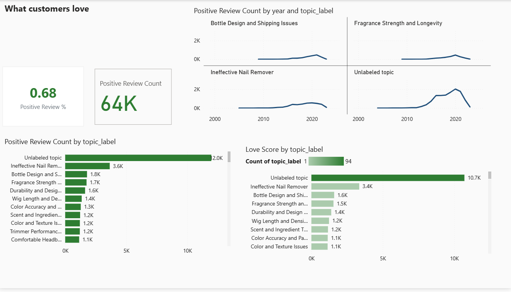
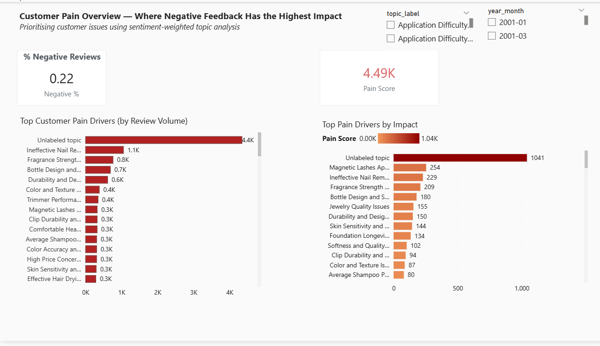

# Customer Intelligence Platform (NLP + LLM)

An **end-to-end Customer Intelligence system** built on ~180k Amazon product reviews to extract **actionable business insights** using NLP, topic modeling, sentiment analysis, and **LLM-assisted labeling**.

This project demonstrates how **unstructured customer feedback** can be transformed into **executive-ready decision support**, not just exploratory NLP analysis.

---

## 🚀 What This Project Does

- Ingests and cleans large-scale customer review data
- Performs **review-level sentiment analysis**
- Discovers latent themes using **BERTopic + sentence embeddings**
- Filters high-signal topics (≥300 reviews) to reduce noise
- Uses an **LLM to generate human-readable, actionable topic labels**
- Produces **business-focused outputs**, including:
  - Top customer pain points (negative impact)
  - Top customer delight themes (positive impact)
  - Sentiment-weighted prioritisation metrics
  - Executive-level analytics dashboard

---

## 📊 Executive Dashboard (Key Output)

This project includes an **executive-ready dashboard** that translates NLP outputs into **clear business priorities**.

### What Customers Love


### Where Customer Pain Has the Highest Impact


### What the Dashboard Answers
- What customers **love most**, at scale
- Where **negative feedback has the highest business impact**
- Which issues should be **prioritised first**, based on *impact*, not raw volume
- How sentiment and topic prevalence **change over time**

📎 Interactive Power BI file:  
`dashboards/powerbi/customer_intelligence.pbix`

---

## 🧠 Core Metrics

To move beyond raw sentiment counts, two custom metrics are introduced:

- **Love Score** = Positive sentiment × Topic frequency  
- **Pain Score** = Negative sentiment × Topic frequency  

These metrics enable **impact-based prioritisation** rather than anecdotal decision-making.

---

## 📊 Example Topics Identified

- Ineffective Nail Remover
- Fragrance Strength and Longevity
- Bottle Design and Shipping Issues
- Headband Sizing and Comfort Issues
- Quality vs. Price Balance

Each topic includes:
- Review volume
- Sentiment distribution
- Average rating
- Business-oriented interpretation

---

## 🧠 System Architecture

```

Raw Reviews
↓
Cleaning & Canonical Schema
↓
Sentiment Analysis
↓
BERTopic (Topic Discovery)
↓
Topic Aggregation
↓
LLM Topic Labeling
↓
Impact Metrics (Pain / Love Scores)
↓
Executive Dashboard & Summary

```

---

## 🛠️ Tech Stack

- **Python**, Pandas, NumPy
- **BERTopic**, SentenceTransformers
- **PyTorch** (GPU-accelerated embeddings)
- **OpenAI API** (LLM-based topic labeling)
- **Power BI** (executive analytics dashboard)

---

## 📄 Key Outputs

- `topic_summary.csv` — sentiment, ratings, and volume per topic
- `topic_labels.csv` — LLM-generated topic labels
- `executive_summary.md` — insight-driven business summary
- `customer_intelligence.pbix` — interactive dashboard

---

## ⚠️ Design Choices & Limitations

- Topics with low confidence are intentionally surfaced as **Unlabeled** to avoid overconfident assignments
- The goal is **prioritisation and decision support**, not causal inference
- LLM outputs are aggregated and thresholded to minimise hallucination risk

---

## 💼 Why This Matters

This project demonstrates the ability to:

- Build **production-style NLP pipelines**
- Combine **unsupervised ML with LLM reasoning**
- Translate raw text data into **decision-ready business insights**
- Design analytics for **product, pricing, and CX stakeholders**

---

## 👤 Author

**Iman Badrooh**  
Data Scientist — NLP • ML • Customer Intelligence
```

